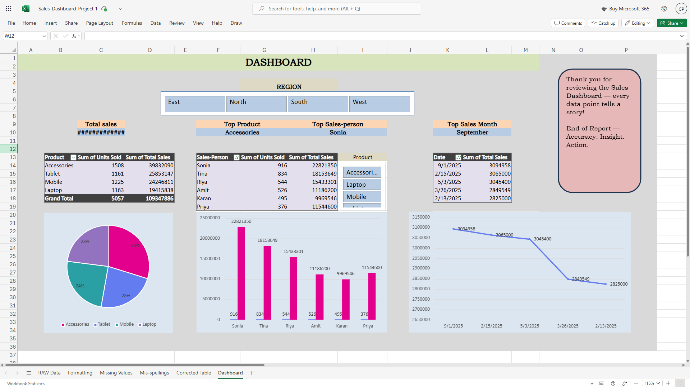

# Excel Sales Dashboard Project 📊

## Objective
- To create an interactive and insightful Sales Dashboard using Microsoft Excel (Web Version).
- To demonstrate skills in data cleaning, data transformation, and visualization using Excel tools.

## Project Overview
This Excel project showcases a complete workflow from raw data to a final interactive dashboard.  
It includes the following sheets:
- Raw Data – Original dataset before cleaning.
- Formatting – Data structured and formatted properly for analysis.
- Missing Values – Handling and imputing missing or null data.
- Mis Spellings – Correcting inconsistent entries and spelling issues.
- Dashboard – Final interactive dashboard with slicers, charts, and key metrics.

## Tools and Techniques Used
- Microsoft Excel (Web Version)
- Pivot Tables and Charts
- Data Cleaning and Validation
- Conditional Formatting
- Data Slicers for Interactivity
- Formulas: IF, SUMIFS, COUNTIFS, VLOOKUP, TEXT, etc.

## Key Features of the Dashboard
- Region-wise filtering using Slicers.
- Monthly Sales Trend visualization.
- KPI metrics for Total Sales, Total Profit, and Average Order Value.
- Interactive shapes and charts linked with data.
- Clean, modern layout for presentation.

## How to View the Dashboard
- Click on the Excel file: **Sales-Dashboard.xlsx**
- Click on the **Download** button or **View Raw** to save the file.
- Open the file using **Excel Desktop** or **Excel Web** for full interactivity.
- Explore slicers, charts, and shapes for insights.

## Project Insights
- Identified top-performing regions and months.
- Found missing and inconsistent entries in sales data.
- Improved data quality and readability.
- Created a visual summary that helps management make data-driven decisions.

## Future Improvements
- Add trend forecasting using Excel formulas or Power Query.
- Connect live data sources for dynamic updates.
- Include interactive buttons or navigation menus.

## Preview
If you are viewing this on GitHub, download and open the file in Excel to explore.  
Add a screenshot below if available:

## Author
- **Chetan Pawar**  
- Data Analyst Enthusiast | Excel | Data Visualization | Problem Solver  
